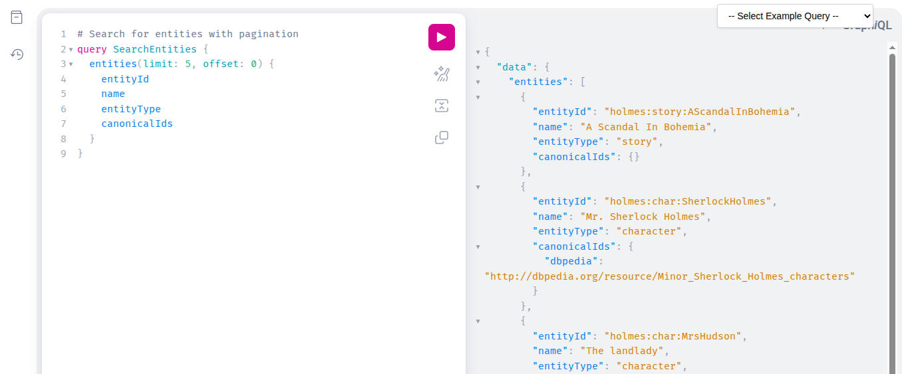

# Architecture



## Producer artifacts vs server bundle

This distinction is foundational to the design of the KG server and should be understood before modifying ingestion, storage, or bundle-loading code.

### Summary

This project has a deliberate separation between:

1. **Producer-side artifacts** (domain-aware, ingestion-time truth)
2. **Server bundle** (domain-neutral, serving-time contract)

The **JSON artifacts produced by ingestion are the single source of truth**. Postgres is a materialized index that can be regenerated from the bundle.

### Producer-side artifacts (single source of truth)

Producer pipelines (e.g., Sherlock, med-lit, future domains) ingest raw sources and emit rich internal artifacts such as:

* One JSON per source document (parsed structure, mentions, spans, evidence, etc.)
* Shared/canonical entity JSON (canonical IDs, merged entities, alias sets)
* Optional intermediate outputs (mentions JSONL, provisional entities, embeddings, provenance)

**Properties**

* Domain-specific and allowed to evolve rapidly
* Optimized for extraction quality and debugging
* May include intermediate/provisional states
* May contain more information than the server will ever need

These artifacts are the authoritative representation of what the ingestion pipeline learned.

### Server bundle (consumer contract)

When ingestion is complete, a **deterministic export step** produces a minimal, validated “bundle” that the generic KG server can load:

```text
bundle/
  manifest.json          # required
  entities.jsonl         # required
  relationships.jsonl    # required
  documents.jsonl        # optional - lists static documentation assets
  docs/                  # optional - directory containing documentation files
```

**Properties**

* Domain-neutral
* Versioned contract (`bundle_version`)
* Validated at server startup:

  * shape validation (manifest + row parsing)
  * referential integrity (relationship endpoints must exist)
* Intended for querying and serving, not extraction
* May include documentation assets (markdown, images, etc.) listed in `documents.jsonl`

The server does not ingest producer-internal artifacts directly. Documentation assets listed in `documents.jsonl` are copied to `/app/docs/` at bundle load time for serving via MkDocs.

### Lifecycle

```text
raw sources
  ↓
producer pipeline
  ↓
producer-side artifacts  (single source of truth)
  ↓
bundle export (deterministic)
  ↓
KG server loads bundle at startup
  ↓
Postgres (materialized index / cache)
```

### Operational rules

* The server loads **one bundle from `/bundle` at startup**.
* After startup, the server is **read-only** (no graph mutation).
* Bundle load is **idempotent** via `bundle_id` and checksum:

  * same `bundle_id` + same checksum → skip load
  * same `bundle_id` + different checksum → hard fail
* The DB schema can be treated as disposable; changes are handled by rebuilding from bundles rather than incremental migrations.

### Why this separation exists

* Keeps the server truly generic and domain-neutral
* Allows producer pipelines to evolve without destabilizing serving
* Makes validation and failure modes crisp at the bundle boundary
* Supports reproducible rebuilds of Postgres from on-disk artifacts

